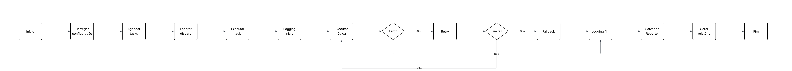

# Scheduling Tasks Module

## Visão Geral

Este módulo permite o agendamento, execução e monitoramento de tarefas (“tasks”) de forma flexível e robusta. Ele suporta agendamento periódico ou em horários fixos, logging detalhado, tratamento de erros com retry e fallback, além de geração de relatórios em memória e em arquivos JSON/CSV.

---

## Tecnologias

- **Node.js**
- **TypeScript**

---

## Fluxo de Execução

O diagrama abaixo ilustra o fluxo completo de execução das tasks, desde o carregamento da configuração até a geração dos relatórios, incluindo tratamento de erros, retries e fallback:



### Princípios e Padrões Utilizados

- **Separação de Responsabilidades:**  
  Cada classe tem uma função clara:

  - `Scheduler`: gerencia o agendamento e execução das tasks.
  - `Task`: encapsula a lógica de cada unidade de trabalho.
  - `Logger`: registra logs detalhados de execução.
  - `Reporter`: armazena e exporta o histórico das execuções.

- **Extensibilidade:**  
  Novos tipos de tasks, estratégias de agendamento, ou formatos de relatório podem ser adicionados sem alterar o núcleo do sistema, seguindo o princípio Open/Closed (OCP).

- **Tratamento de Erros:**  
  O sistema implementa retries configuráveis, fallback e logging de falhas, garantindo resiliência e rastreabilidade.

- **Padrões de Projeto Aplicados:**
  - _Template Method_: Define o esqueleto da execução de uma task, permitindo customização de etapas específicas.
  - _Strategy_: Permite diferentes estratégias de agendamento (intervalo ou horário fixo).
  - _Middleware_: Possibilita adicionar lógica extra antes/depois da execução das tasks.

---

## Principais Arquivos

- `src/core/entities/Task.ts` — Base para tasks customizadas.
- `src/infra/scheduler/Scheduler.ts` — Lógica de agendamento e execução.
- `src/infra/logger/Logger.ts` — Logging detalhado.
- `src/infra/reporter/Reporter.ts` — Histórico e exportação de relatórios.
- `src/app/index.ts` — Ponto de entrada da aplicação.

---

### 1. Definição das Tasks

As tasks são definidas em um arquivo de configuração, cada uma com:

- Identificador único
- Metadados de agendamento (intervalo ou horário fixo)
- Parâmetros específicos

Exemplo de configuração:

```json
[
  {
    "id": "task1",
    "type": "interval",
    "intervalSeconds": 60
  },
  {
    "id": "task2",
    "type": "fixed",
    "fixedTime": "02:00"
  }
]
```

### 2. Agendamento

O Scheduler lê as tasks e agenda cada uma conforme seus metadados:

- **Intervalo:** Executa a cada X segundos/minutos.
- **Horário fixo:** Executa em horários específicos do dia.

### 3. Execução

Quando chega o momento:

- O Scheduler executa a task.
- O Logger registra início, fim, sucesso, erro e fallback.
- Em caso de erro, o módulo realiza retries configuráveis.
- Se persistir a falha, executa o fallback ou marca como falha.

### 4. Relatórios

O Reporter mantém o histórico de execuções:

- Em memória, para consulta rápida.
- Exportação para arquivos JSON e CSV.

## 5. Configuração do Ambiente

Crie um arquivo `.env` na raiz do projeto com base no exemplo `.env.example`.  
Preencha os valores conforme a necessidade da sua aplicação:

```bash
# Tempo máximo de execução de cada task (em milissegundos)
TASK_TIMEOUT_MS=60000

# Número máximo de tentativas (retries) em caso de falha na execução da task
TASK_MAX_RETRIES=3
```

Essas variáveis controlam o tempo limite e o número de tentativas para execução das tasks.
